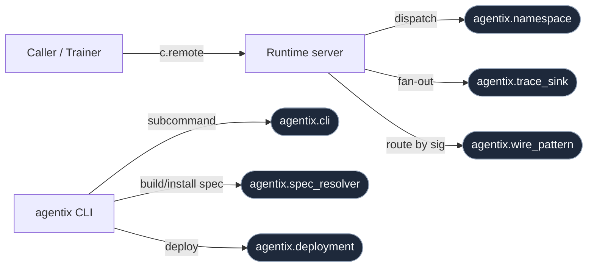

# The six plugin axes

Agentix is extensible along **six** axes. Each one is a Python entry-point
group; every plugin is a normal pip-installable distribution declaring one
TOML block. The framework discovers them via `importlib.metadata` and
exposes them through the runtime, the dispatcher, or the CLI.



All six axes follow the same plug pattern:

```toml
[project.entry-points."agentix.<axis>"]
my-thing = "module:Thing"
```

What changes per axis is **how the framework consumes the plugins it
finds** — select-one, fan-out, chain, or merge.

---

## At a glance

| Axis | Group | Shape | Built-ins | When you reach for it |
|---|---|---|---|---|
| [Namespaces](#namespaces) | `agentix.namespace` | **select-many**, lazy-load on first call | (third-party only) | Anything your trainer / harness calls into the sandbox |
| [Deployments](#deployments) | `agentix.deployment` | **select-one** by CLI name | `local` / `daytona` / `e2b` | A new sandbox host (Fly, Modal, k8s, …) |
| [Trace sinks](#trace-sinks) | `agentix.trace_sink` | **fan-out** with error isolation | (third-party only) | Pipe `trace.emit` events to Sentry/OTel/your bus |
| [Spec resolvers](#spec-resolvers) | `agentix.spec_resolver` | **chain-of-responsibility**, priority desc | `path` / `image` / `local_repo` / `pypi` | Teach `agentix build foo` a new spec form |
| [Wire patterns](#wire-patterns) | `agentix.wire_pattern` | **first-match by signature** | `unary` / `stream` / `bidi` | A new call shape (pubsub, batch, …) |
| [CLI subcommands](#cli-subcommands) | `agentix.cli` | **merge-namespace** | `build` / `install` / `deploy` / `check` / `plugins` | A new `agentix <name>` verb |

!!! tip "Discoverability check"
    `agentix plugins` walks every axis and prints what's installed,
    where it came from (`dist@version`), and whether it loaded cleanly.
    Run it after `pip install <your-extension>` to confirm the framework
    picked your wheel up.

---

## Namespaces

**Group:** `agentix.namespace` &nbsp;&middot;&nbsp; **Shape:** select-many, lazy-load on first call

The dispatch surface. A namespace is a Python class whose `@staticmethod`
methods are remote-callable. The class itself is a pure namespace — no
instance state, no `self`. `c.remote(Bash.run, command="ls")` reads
`Bash.run.__module__` as the routing key, the runtime imports the class
on first call, and the method body runs inside the sandbox.

=== "Caller side"

    ```python
    from agentix.bash import Bash
    result = await c.remote(Bash.run, command="echo hi")
    ```

=== "Plugin side"

    ```python title="src/agentix/myagent/__init__.py"
    from agentix.namespace import Namespace

    class MyAgent(Namespace):
        @staticmethod
        async def run(instruction: str) -> str:
            ...
    ```

=== "pyproject.toml"

    ```toml
    [project.entry-points."agentix.namespace"]
    myagent = "agentix.myagent:MyAgent"
    ```

**Why select-many lazy-load?** Sandboxes may mount dozens of namespaces;
importing them all at boot would pay a real cost. The framework records
the entry-point object at startup but defers `ep.load()` until the
first dispatch for that namespace. A broken namespace surfaces *on
call*, not at boot — and unused namespaces cost zero.

**When you write one:** anything you want the trainer to call inside
the sandbox — an agent runtime (Claude Code, OpenHands), a benchmark
harness (SWE-bench, MLE-Bench), a primitive (shell, files, browser).

---

## Deployments

**Group:** `agentix.deployment` &nbsp;&middot;&nbsp; **Shape:** select-one by CLI name &nbsp;&middot;&nbsp; **Built-ins:** `local`, `daytona`, `e2b`

Sandbox lifecycle: `create / delete / get`. A structural `Protocol` —
backends don't inherit; they just implement three methods. The user
picks one with `agentix deploy <backend>`; the framework calls `cls()`
with no constructor arguments (backends read their config from
environment variables — `DAYTONA_API_KEY`, `E2B_API_KEY`, etc.).

=== "Plugin"

    ```python title="my_deploy/__init__.py"
    import os
    from agentix.deployment.base import Sandbox
    from agentix.idents import SandboxId
    from agentix.models import SandboxConfig, SandboxInfo

    class FlyDeployment:                    # (1)!
        def __init__(self) -> None:
            self._token = os.environ["FLY_API_TOKEN"]

        async def create(self, config: SandboxConfig) -> Sandbox: ...
        async def delete(self, sandbox_id: SandboxId) -> None: ...
        async def get(self, sandbox_id: SandboxId) -> SandboxInfo: ...
    ```

    1. No inheritance — structural type matching against `Deployment`
       Protocol. `isinstance(FlyDeployment(), Deployment)` returns True
       on its own.

=== "pyproject.toml"

    ```toml
    [project.entry-points."agentix.deployment"]
    fly = "my_deploy:FlyDeployment"
    ```

After `pip install`, `agentix deploy fly --image my-agent:0.1.0` is
live.

**Why select-one?** A sandbox runs on one host at a time; picking the
backend is a single user choice. Two dists registering the same name
raise `PluginConflictError` with both dist+version labels — silent
last-wins would hide a stale install.

**When you write one:** a new managed-sandbox host or a custom
on-prem deployment.

---

## Trace sinks

**Group:** `agentix.trace_sink` &nbsp;&middot;&nbsp; **Shape:** fan-out, per-sink error isolation

Every closure-side `agentix.trace.emit(kind, payload)` call is
delivered to every registered sink in registration order. Sinks
register via an **installer** — a callable the framework invokes once
at lifespan startup. This mirrors the way Sentry and OpenTelemetry
SDKs hook themselves into a host process.

```python title="my_otel_sink/__init__.py"
from opentelemetry import trace as otel
from agentix.trace import register_sink

def install() -> None:
    tracer = otel.get_tracer("agentix")

    def sink(kind, payload, call_id, source):
        with tracer.start_as_current_span(f"agentix.{kind}") as span:
            span.set_attribute("agentix.call_id", call_id or "")
            for k, v in payload.items():
                span.set_attribute(f"agentix.payload.{k}", v)

    register_sink(sink)
```

```toml
[project.entry-points."agentix.trace_sink"]
otel = "my_otel_sink:install"
```

**Why fan-out?** Observability is additive — you might ship traces to
Sentry, OTel, Logfire, AND a local JSONL file in the same run.
Selecting one defeats the purpose. Each sink runs in a `try` block; a
crashing sink doesn't block siblings or the runtime.

!!! warning "Sinks must never raise to the caller"
    The framework swallows exceptions and logs them. A sink that
    deadlocks or hangs forever *will* slow tracing, though — keep
    `sink(...)` bodies short and offload heavy work (network I/O,
    file flushes) to a background thread or async task.

**When you write one:** any external observability product you want
agent runs to surface in.

---

## Spec resolvers

**Group:** `agentix.spec_resolver` &nbsp;&middot;&nbsp; **Shape:** chain-of-responsibility (priority desc) &nbsp;&middot;&nbsp; **Built-ins:** `path`/`image`/`local_repo`/`pypi`

`agentix build foo` and `agentix install foo bar baz` accept a *spec*
— a single string. Resolvers turn that string into a `NamespaceSpec`
the build pipeline understands. The framework iterates registered
resolvers by `priority` descending and takes the first non-`None`
result.

```python title="my_github_resolver/__init__.py"
from agentix.cli._resolve import NamespaceSpec

class GithubResolver:
    priority = 30                                # (1)!

    def resolve(self, spec: str) -> NamespaceSpec | None:
        if not spec.startswith("github:"):       # (2)!
            return None
        org_repo = spec[len("github:"):]
        return NamespaceSpec(
            short=org_repo.split("/")[-1],
            kind="pypi",
            pypi_dist=f"agentix-{org_repo.replace('/', '-')}",
        )
```

1. Higher = earlier in the chain. Built-in priorities: `path` 100,
   `image` 90, `local_repo` 50, `pypi` 10. Pick yours to slot in.
2. Return `None` to let the next resolver try. This is how chains
   stay composable — every resolver claims only its own format.

```toml
[project.entry-points."agentix.spec_resolver"]
github = "my_github_resolver:GithubResolver"
```

**Why a chain?** A single string ("bash", "./primitives/bash",
"docker.io/me/agent:1.0", "github:my-org/my-thing") can mean four
different things depending on shape. Each resolver's `resolve()`
returns `None` if it doesn't recognize the string; the next one
gets a shot. New input formats slot in without framework changes.

**When you write one:** a new way for users to point at a closure —
a private registry, a Git repo, an HTTP URL, a build-server artifact.

---

## Wire patterns

**Group:** `agentix.wire_pattern` &nbsp;&middot;&nbsp; **Shape:** first-match by signature &nbsp;&middot;&nbsp; **Built-ins:** `unary`, `stream`, `bidi`

When `c.remote(Method, …)` runs, the framework inspects `Method`'s
signature and picks a wire pattern. Unary returns → HTTP. `AsyncIterator`
returns → Socket.IO stream. `AsyncIterator` param + `AsyncIterator`
return → bidi. Wire patterns are the strategy objects that own the
client-side framing for each shape.

```python title="my_pubsub_pattern/__init__.py"
import inspect
from agentix.wire import WirePattern

class PubSubPattern(WirePattern):
    name = "pubsub"

    @classmethod
    def matches(cls, sig: inspect.Signature) -> bool:
        # detect your marker type on the return annotation
        return getattr(sig.return_annotation, "__origin__", None) is Topic

    def bind(self, sig: inspect.Signature) -> None: ...
    def client_invoke(self, client, fn, sig, args, kwargs): ...
```

```toml
[project.entry-points."agentix.wire_pattern"]
pubsub = "my_pubsub_pattern:PubSubPattern"
```

Entry-point patterns come **ahead** of the three built-ins; an
in-process `register_pattern(cls)` overrides an entry-point pattern of
the same name (handy for tests, dangerous in prod).

**Why first-match by signature?** The user shouldn't have to *tell*
the framework which wire to use — the method signature is enough
information. New call shapes are pure plugin work; the framework's
runtime doesn't need to know about them.

**When you write one:** a new transport semantic — pubsub broadcast,
batched RPC, server-side push, anything that doesn't fit
unary/stream/bidi.

!!! info "Most extensions don't need this"
    99% of namespaces are fine with the three built-ins. Wire patterns
    are the framework's escape hatch when a brand-new call shape
    earns its keep.

---

## CLI subcommands

**Group:** `agentix.cli` &nbsp;&middot;&nbsp; **Shape:** merge-namespace &nbsp;&middot;&nbsp; **Built-ins:** `build`, `install`, `deploy`, `check`, `plugins`

`agentix <name>` is discovered the same way every other plugin is:
walk the `agentix.cli` group, the entry-point target is a
`main(argv: list[str]) -> int` callable. The framework's own
subcommands ship via this group too — dogfood.

```python title="my_extra/__init__.py"
import argparse

def main(argv: list[str]) -> int:
    """`agentix extra` — short description for `agentix --help`."""
    parser = argparse.ArgumentParser(prog="agentix extra")
    parser.add_argument("thing")
    args = parser.parse_args(argv)
    print(f"doing extra cool stuff with {args.thing}")
    return 0
```

```toml
[project.entry-points."agentix.cli"]
extra = "my_extra:main"
```

After install:

```bash
$ agentix --help
commands:
  build    build a single namespace image
  …
  extra    `agentix extra` — short description for `agentix --help`.   # (1)!
```

1. The description comes from the first line of `main()`'s docstring,
   or falls back to its module's docstring.

**Why merge-namespace?** Every installed dist contributes its own
subcommands to a single flat namespace. Conflicts on subcommand name
are loud (the framework refuses to silently shadow).

**When you write one:** a new `agentix <verb>` for your workflow —
publishing artifacts, scaffolding new namespaces, generating wheels,
introspecting an environment. Anything that's "an agentix concept
operation" but doesn't fit `build / install / deploy / check / plugins`.

---

## Cross-cutting principles

All six axes share a small set of design rules that fall out of the
entry-point model.

!!! abstract "Same install UX"
    Every extension ships as a wheel. `pip install <extension>` plus a
    one-line entry-point block makes it live. No framework patch, no
    config file, no decorator at import time. `agentix plugins`
    confirms the framework picked it up.

!!! abstract "Composition over inheritance"
    None of the axes require subclassing. `Deployment` and
    `SpecResolver` are `Protocol`s; `Namespace` is a marker base used
    purely for the discovery hook; everything else is callable-or-
    class shapes. The framework never demands you inherit from it to
    plug in.

!!! abstract "Conflicts surface loudly"
    Two dists registering the same name in the same group raise
    `PluginConflictError` with both `dist@version` labels. Silent
    last-wins is the wrong default — it hides stale installs.

!!! abstract "One failure doesn't poison the rest"
    Loader exceptions are caught per-entry. `agentix plugins` shows
    the failures; siblings keep working. The runtime starts cleanly
    even if one plugin is broken.

!!! abstract "Imperative `register_*` for tests"
    Every axis exposes an in-process helper —
    `register_deployment`, `register_sink`, `register_spec_resolver`,
    `register_pattern` — that bypasses entry-point discovery.
    Production code paths don't touch these; tests use them to inject
    stubs without installing distributions.

For the full how-to of writing each axis end-to-end, see the
[Plugin authors guide](plugins.md).
