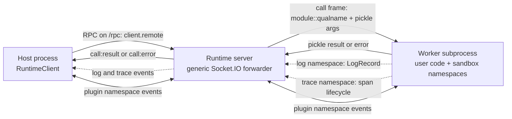
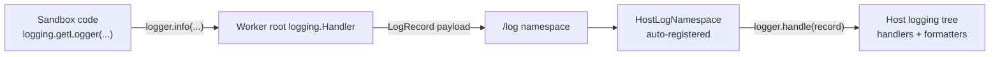
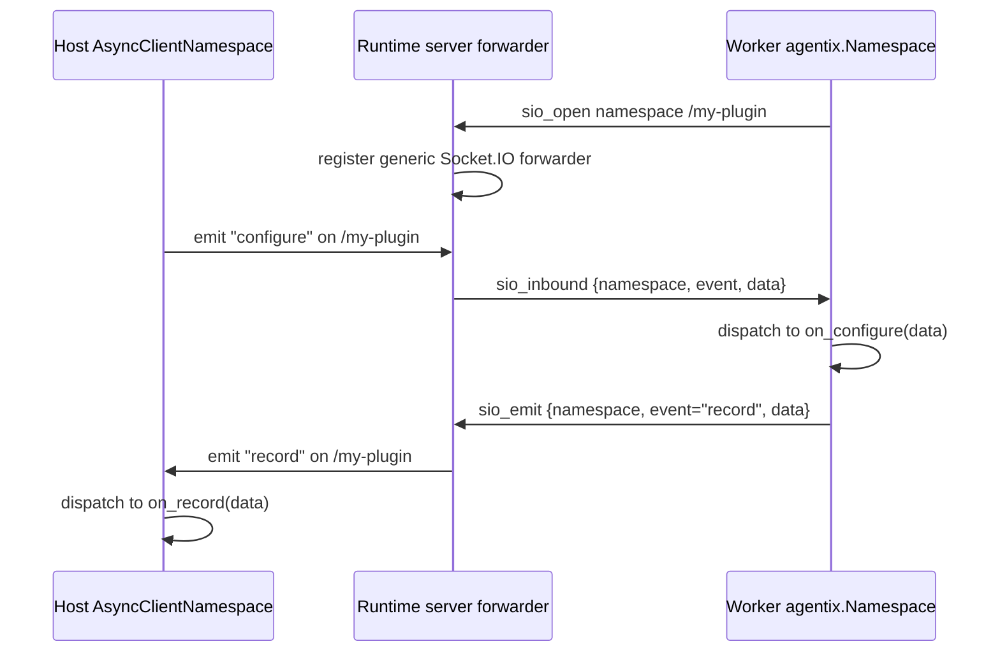

Agentix plugins extend the runtime in two different ways:

1. expose importable Python functions that callers run with `client.remote`
2. open side-channel Socket.IO namespaces for events between host and sandbox

The runtime server stays generic. It does not know plugin event names or
payload schemas; it only forwards namespace traffic between the host client and
the worker process.




## The Three Core Systems

Agentix core owns three reserved Socket.IO namespaces:

| Namespace | System | User-facing API | Extension point |
| --- | --- | --- | --- |
| `/rpc` | RPC | `await client.remote(fn, *args, **kwargs)` | expose a normal importable Python callable |
| `/log` | logging | stdlib `logging` in sandbox code | configure host logging handlers, levels, and formatters |
| `/trace` | tracing | `agentix.trace.trace(...)`, `agentix.trace.span(...)` | register `agentix.trace.Processor` implementations |

Plugins must not claim these namespaces. A plugin that needs its own event
protocol uses its own namespace, conventionally `/<package-name>`.

## RPC: Extend With Callables

The `/rpc` namespace is the remote-call protocol. Users extend it by
installing functions into the bundle, not by subclassing a base class:

```python
# app.py, installed in the bundle
async def run(input: str) -> dict:
    return {"output": input.upper()}
```

The host calls the function object:

```python
from app import run

result = await client.remote(run, input="hello")
```

`RuntimeClient` serializes the target as `fn.__module__ + "::" +
fn.__qualname__`, pickles args and kwargs, and the worker imports the same
callable inside the sandbox.

## Logging: Extend With stdlib logging

The `/log` namespace is the logging bridge. Sandbox code uses standard Python
logging:

```python
import logging

logger = logging.getLogger(__name__)

async def run() -> None:
    logger.info("starting rollout")
```

At worker boot, Agentix installs a root `logging.Handler` that forwards
`LogRecord` data over `/log`. `RuntimeClient` automatically registers the host
consumer and replays those records into the host logging tree.



Users customize logging with normal logging configuration on the host:

```python
import logging
from agentix.utils.log import configure_logging

configure_logging(default_context="host")
logging.getLogger("my_eval").setLevel(logging.INFO)
```

Do not register your own `/log` namespace. If a plugin needs structured events
that are not log records, give the plugin its own namespace.

## Tracing: Extend With Processors

The `/trace` namespace is the trace bridge. User code creates traces and spans:

```python
from agentix import trace

async def run() -> None:
    with trace.trace("eval"):
        with trace.span("agent.step", model="claude") as span:
            span.add_event("first_token")
```

At worker boot, Agentix installs an internal `trace.Processor` that forwards
trace and span lifecycle events over `/trace`. `RuntimeClient` automatically
registers the host consumer, which replays those events into the host trace
provider.

```mermaid actions={false}
flowchart LR
    UserSpan["Sandbox code<br/>trace.span(...)"]
    WorkerProvider["Worker trace provider"]
    ForwardProcessor["_ForwardProcessor<br/>internal"]
    TraceNamespace["/trace namespace"]
    HostTrace["HostTraceNamespace<br/>auto-registered"]
    HostProvider["Host trace provider"]
    UserProcessor["User trace.Processor"]

    UserSpan --> WorkerProvider
    WorkerProvider --> ForwardProcessor
    ForwardProcessor -->|"trace_start / span_start / span_end"| TraceNamespace
    TraceNamespace --> HostTrace
    HostTrace -->|"replay lifecycle"| HostProvider
    HostProvider --> UserProcessor
```



Users extend tracing by registering processors:

```python
from agentix import trace

class CaptureProcessor(trace.Processor):
    def on_trace_start(self, t: trace.Trace) -> None:
        ...

    def on_trace_end(self, t: trace.Trace) -> None:
        ...

    def on_span_start(self, s: trace.Span) -> None:
        ...

    def on_span_end(self, s: trace.Span) -> None:
        ...

    def force_flush(self) -> None:
        ...

    def shutdown(self) -> None:
        ...

trace.add_processor(CaptureProcessor())
```

A processor registered in the host process receives host-local spans and spans
replayed from sandbox `/trace` events. A processor registered inside sandbox
code receives sandbox-local spans.

Do not register your own `/trace` namespace. If a plugin needs a different
event model, use a plugin namespace and optionally convert those events into
spans through a `trace.Processor`.

## Plugin Namespaces

A plugin namespace has two optional halves:

- a sandbox-side `agentix.Namespace`, registered inside the worker
- a host-side `agentix.AsyncClientNamespace`, registered on `RuntimeClient`

The sandbox side emits events or handles host requests:

```python
import agentix

class MyService(agentix.Namespace):
    namespace = "/my-plugin"

    async def on_configure(self, payload):
        ...

agentix.register_namespace(MyService())
```

The host side receives events or replies to sandbox requests:

```python
import agentix

class MyHost(agentix.AsyncClientNamespace):
    def __init__(self):
        super().__init__("/my-plugin")

    async def on_record(self, payload):
        ...

client = agentix.RuntimeClient(runtime_url)
client.register_namespace(MyHost())

async with client:
    ...
```

`RuntimeClient.register_namespace(...)` must run before entering the async
context, because the Socket.IO connection plan is fixed at connect time.

## What the Server Does

The runtime server is namespace-opaque:



When the worker registers a namespace, it sends `sio_open` to the server. The
server then registers a matching Socket.IO forwarder. This is why plugins do
not need runtime-server patches for new event protocols.

## Packaging a Plugin

A plugin package can contribute any combination of:

- importable functions that callers invoke with `client.remote`
- sandbox-side namespaces registered by code running in the worker
- host-side namespace handlers registered on `RuntimeClient`
- deployment backends through the `agentix.deployment` entry-point group
- system dependency closures through the `agentix.nix` entry-point group

Keep these boundaries separate. Remote calls are the main RPC system; `/log`
and `/trace` are core side channels; plugin-specific protocols belong on the
plugin's own namespace.
