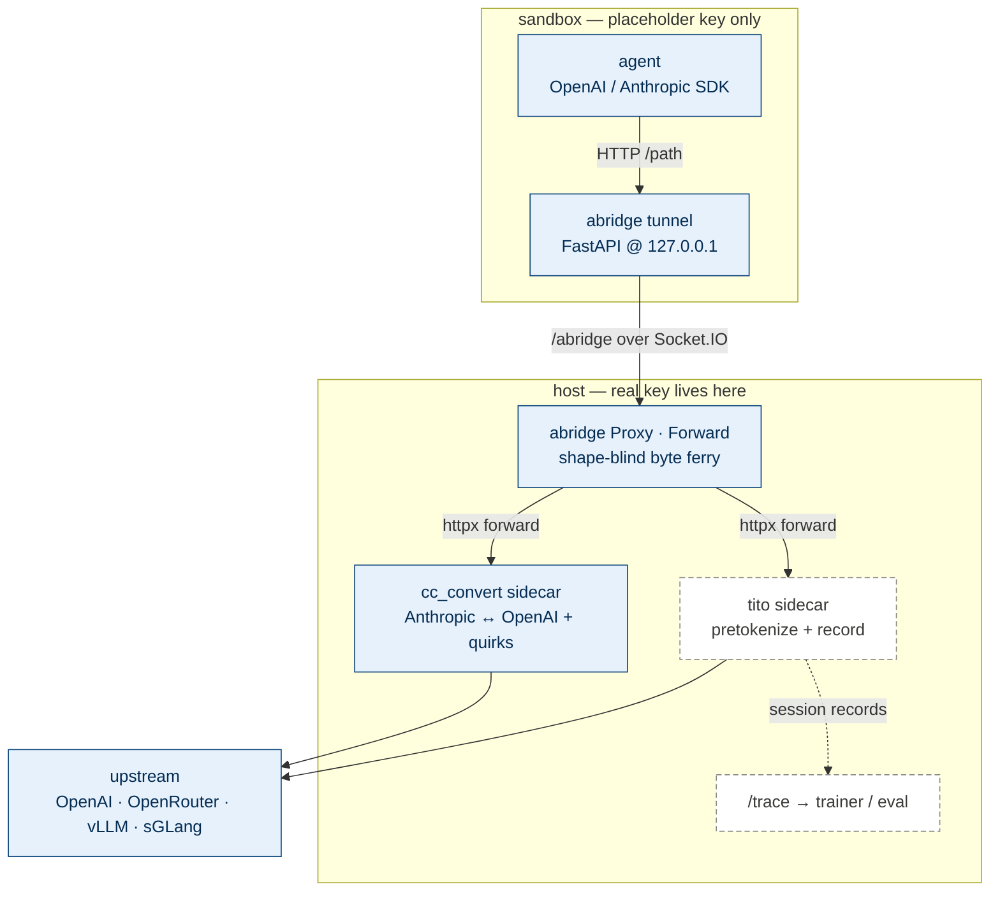

# abridge in Agentix

abridge is the bridge between an in-sandbox agent and the LLMs it calls.
Its one irreplaceable job is **transport + credential isolation**: the
agent runs inside a sandbox and reaches the outside world *only* through
abridge's tunnel, so the real upstream API key never enters the sandbox.

Everything shape-aware — Anthropic↔OpenAI translation, vLLM/SGLang
quirks, RL pretokenization and trajectory recording — lives **behind**
abridge in host-side **sidecars**. abridge core stays shape- and
protocol-blind: it ferries bytes to a sidecar URL and returns the bytes
verbatim.

Solid = landed in this PR. Dashed = planned (see below).

## The three layers

| Layer | What | Where |
|---|---|---|
| **Transport kernel** | sandbox↔host byte ferry, credential isolation, path routing | abridge core (`proxy.py`, `forward.py`, `sidecar.py`) |
| **Gateway** | translation, pretokenization, mock/replay — all protocol/ML logic | host-side sidecars (`cc_convert`, `tito`), reused as-is |
| **Rollout data** | per-session trajectory → `/trace` → trainer/eval | `rollout.py` + trajectory bridge *(planned)* |

## Primitives

- **`Forward(target_url, paths=[...])`** — the only "client" abridge
  needs: a protocol-blind handler that POSTs the agent's request to a
  sidecar and returns the bytes. Stamps `x-session-id` / `x-request-id`
  for rollout identity.
- **`Sidecar(command=..., health_path=...)`** — owns a local sidecar
  process's lifecycle (spawn → health → URL → teardown). abridge-managed
  by default; pass an external URL straight to `Forward` to opt out.
- **`cc_convert_sidecar(...)`** — preset that runs the `cc_convert` Rust
  binary as an Anthropic↔OpenAI translation sidecar.

## Status

- **Landed:** `Forward`, `Sidecar`, the `cc_convert` translation sidecar,
  end-to-end tested (Anthropic agent → abridge → cc_convert → OpenAI
  upstream → translated Anthropic back, streaming and non-streaming).
- **Planned:** the `tito` pretokenize/record sidecar + a first-class
  `Session`/`Trajectory` model bridged onto `/trace`; a streaming
  Plugin primitive (`@on` / `@stream`) with abridge as a specialization;
  removal of the legacy in-process translation clients.
