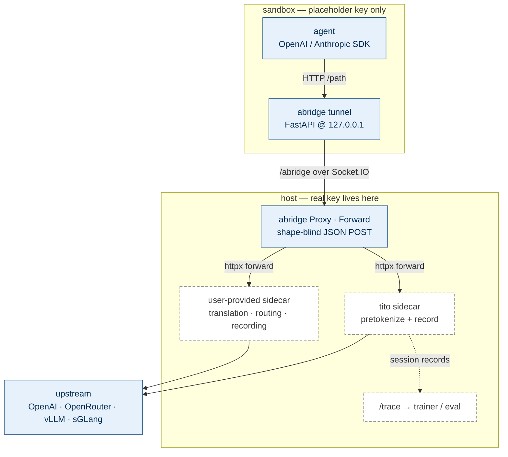

# abridge in Agentix

abridge is the bridge between an in-sandbox agent and the LLMs it calls.
When the agent SDK is pointed at abridge's loopback URL, abridge provides
**request routing + credential isolation**: the placeholder credential
stays in the sandbox while the real upstream API key remains on the host.

Everything shape-aware — Anthropic↔OpenAI translation, vLLM/SGLang
quirks, RL pretokenization and trajectory recording — can live in an
existing in-process client or behind abridge in a host-side **sidecar**.
The current tunnel is shape-blind at the JSON-schema level, not a generic
HTTP byte proxy: it accepts declared JSON POST routes, sends the decoded
object over Socket.IO, and returns one fully buffered response.

Solid = code present in this branch. Dashed = planned (see below).

## The three layers

| Layer | What | Where |
|---|---|---|
| **Transport kernel** | sandbox↔host JSON POST routing, credential isolation, buffered responses | abridge core (`proxy.py`, `forward.py`, `sidecar.py`) |
| **Gateway** | translation, pretokenization, mock/replay — all protocol/ML logic | user-provided host-side sidecars or external services |
| **Rollout data** | per-session trajectory → `/trace` → trainer/eval | `rollout.py` + trajectory bridge *(planned)* |

## Primitives

- **`Forward(target_url, paths=[...])`** — a shape-blind handler that
  POSTs the decoded JSON body to a sidecar and returns one buffered
  response. It stamps `x-session-id` / `x-request-id` for rollout
  identity. Request headers, query parameters, and non-JSON bodies are
  outside the current contract.
- **`Sidecar(command=..., health_path=...)`** — owns a local sidecar
  process's lifecycle (spawn → health → URL → teardown). abridge-managed
  by default; pass an external URL straight to `Forward` to opt out.

## Status

- **Implemented in this branch:** `Forward` and generic `Sidecar` process
  supervision. Tests cover a local HTTP sidecar, the complete in-process
  tunnel/namespace/Proxy/Forward path, process cleanup, noisy output, and
  auto-port bind retries.
- **Not implemented yet:** incremental SSE delivery. `Forward` buffers the
  complete sidecar response before the tunnel sends it to the agent.
- **Planned:** pinned adapters for specific gateway binaries, a deployed
  runtime/SIO/sidecar integration check, the `tito` pretokenize/record
  sidecar, a first-class `Session`/`Trajectory` model bridged onto `/trace`,
  and an open/chunk/end streaming primitive. Existing in-process clients
  remain supported until a separate migration removes them.
